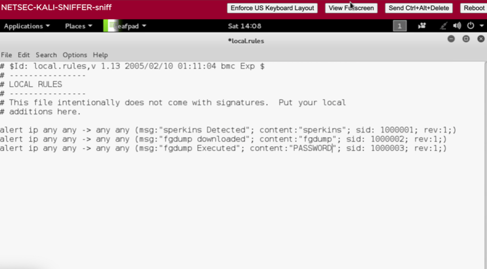

# Custom Snort Rule Development

## Objective

Develop custom Snort detection rules to identify suspicious activity.

## Tools Used

- Snort
- Kali Linux

## Activities

- Created custom IDS rules
- Tested detection logic
- Validated alerts
- Monitored generated events

## Findings

- Detected execution of suspicious tools
- Generated custom alerts
- Improved visibility into network activity

## Skills Demonstrated

- Detection Engineering
- Signature Development
- Threat Detection
## Custom Snort Rules

This project demonstrates the creation and implementation of custom Snort intrusion detection rules to identify and alert on specific network activities and potential threats.

### Rule Configuration and Results

