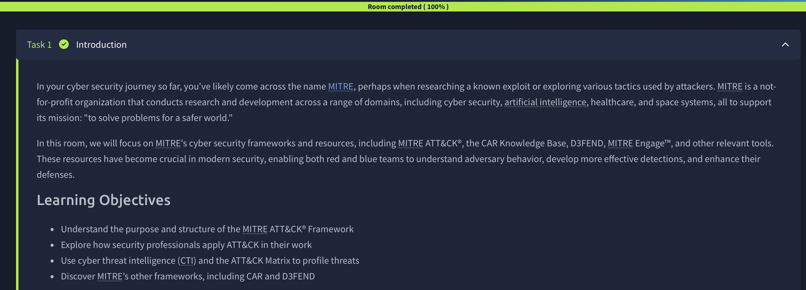
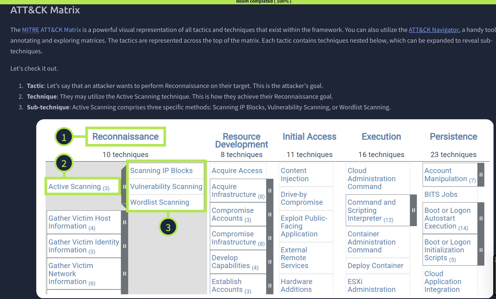
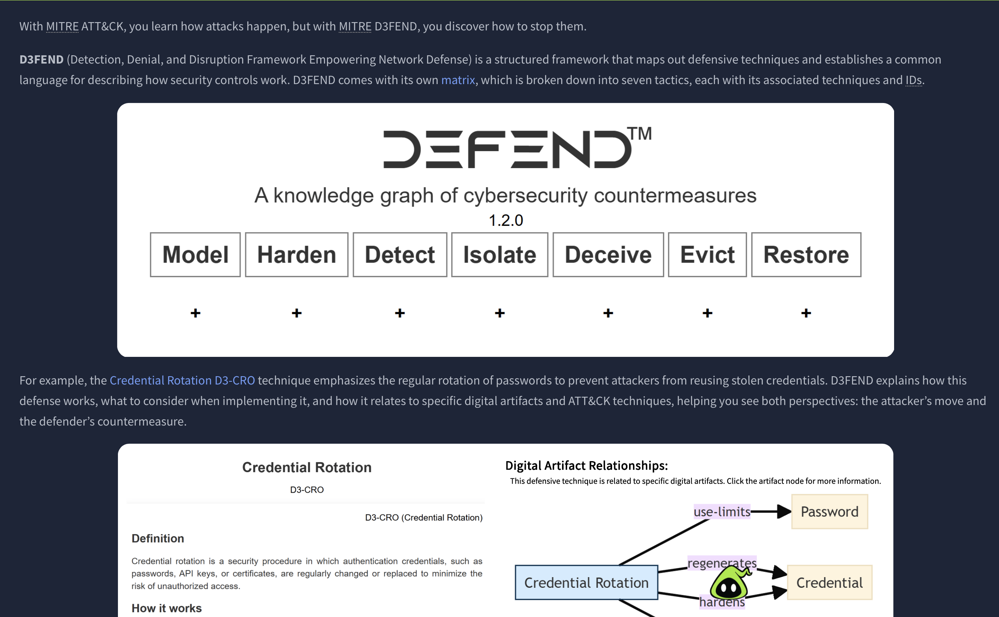
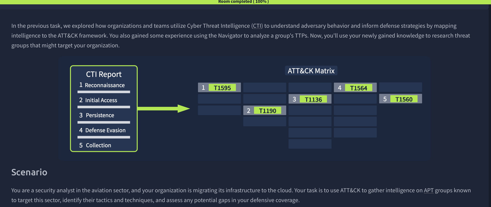
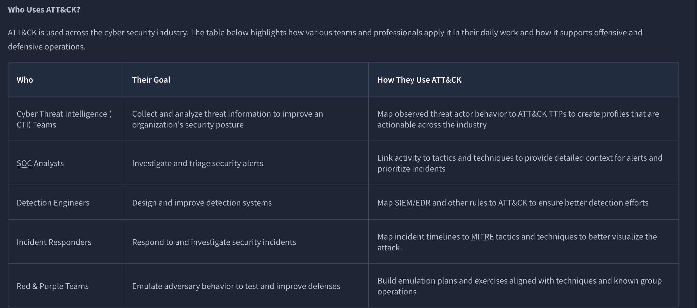

# MITRE ATT&CK

## Overview

This TryHackMe room introduced the MITRE ATT&CK framework and demonstrated how security teams use tactics, techniques, and procedures (TTPs) to understand and track adversary behavior.

## Skills Demonstrated

- ATT&CK framework navigation
- Threat intelligence analysis
- Adversary behavior mapping
- ATT&CK Matrix interpretation
- MITRE D3FEND concepts
- Detection and defense planning

## Screenshots

### Introduction

### ATT&CK Matrix

### MITRE D3FEND

### CTI Report Analysis

### Who Uses ATT&CK

