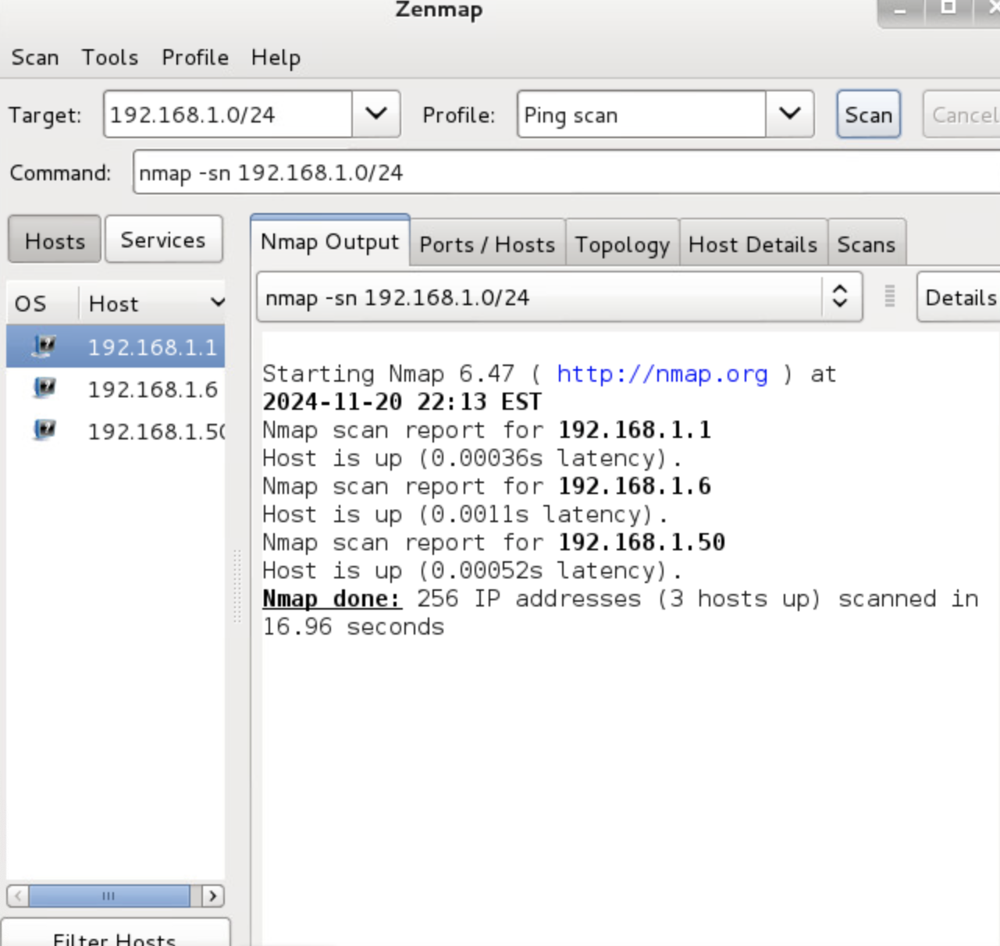
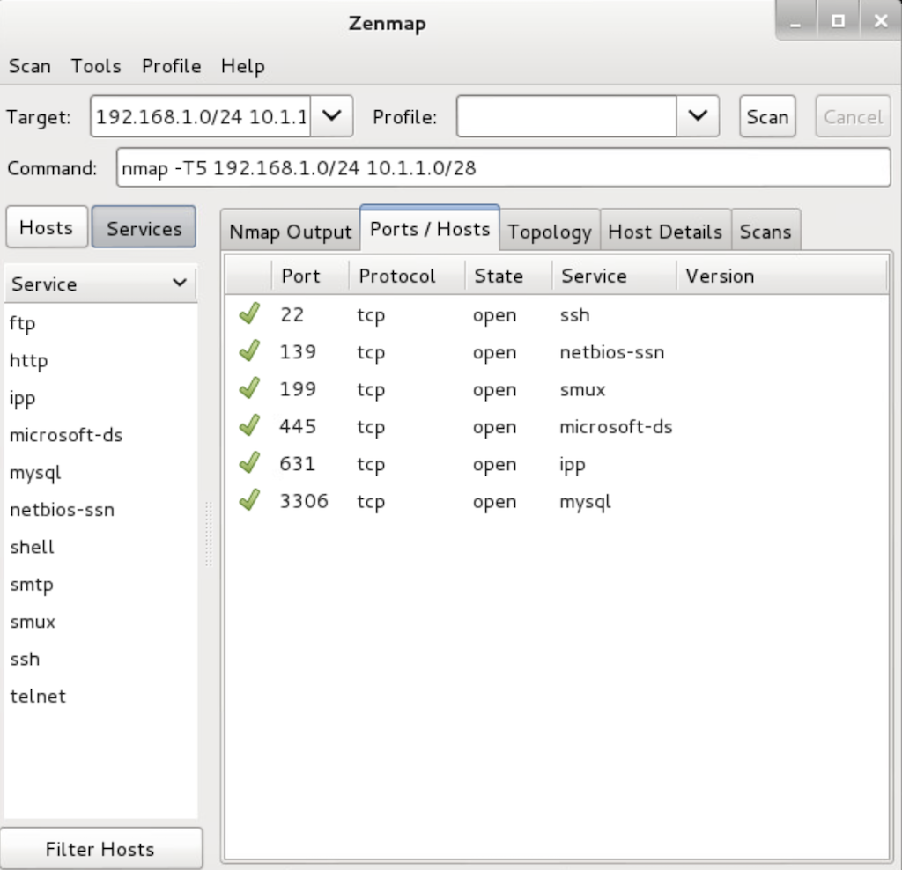

# Network Enumeration and Scanning

## Objective

Perform network reconnaissance and service enumeration to identify active hosts, discover exposed services, and assess the attack surface of a target network.

## Tools Used

- Nmap
- Network Scanning Techniques
- Service Enumeration

## Skills Demonstrated

- Network Reconnaissance
- Host Discovery
- Service Enumeration
- Attack Surface Analysis
- Security Assessment

## Host Discovery

The initial phase of the assessment focused on identifying live hosts within the target environment.

### Findings

- Identified active systems on the network
- Established scope for further enumeration
- Determined potential targets for analysis

## Service Enumeration

Once active hosts were identified, service enumeration was performed to identify open ports and running services.

### Findings

- Enumerated exposed network services
- Identified listening ports
- Collected information about available services

## Key Takeaways

- Network enumeration provides visibility into the attack surface.
- Host discovery is a critical first step in security assessments.
- Service enumeration helps identify potential security risks and misconfigurations.
